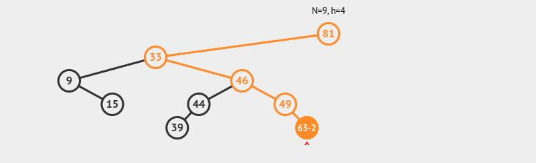

<div align="right">

</div>

# TDA ABB

# ESTO ES UN TEMPLATE, COMPLETAR LO QUE HAGA FALTA, ELIMINAR LO QUE SOBRE (INCLUIDA ESTA LÍNEA)

## Alumno: Maximiliano Fittipaldi - 111676 - mafittipaldi@fi.uba.ar

- Para compilar y ejecutar TODO:

```bash
make
```

- Para compilar y ejecutar pruebas:

```bash
make valgrind-alumno
```

- Para compilar y ejecutar tp:
```bash
make valgrind-tp_abb
```

---

## Teoría sobre árboles binarios
### ¿Qué es un árbol?
Un árbol es una colección de **nodos**.
Según la **rae** un nodo es:
*"En un esquema o representación gráfica en forma de árbol,*
*cada uno de los puntos de origen de las distintas ramificaciones."*
Y en esta definición tenemos dos conceptos interesantes: **ramificaciones** y
**puntos de origen**. En un árbol, siempre vamos a tener un punto de origen al
que vamos a llamar **raíz** y también, en caso de tener más de un nodo, vamos
a tener ramificaciones que van a otros nodos, en vez de hablar de la cantidad
de ramificaciones, vamos a hablar de cantidad de **nodos hijo** que posee el nodo
de origen, es decir, el **nodo padre**. Y, ¿Cómo llamaríamos a los nodos sin hijos?
Como vemos en un árbol de la vida real, cuando éste deja de ramificarse, aparecen
**hojas**, y las hojas ya no tienen ramas, ¿No? Bueno, para una estructura de árbol
podríamos llamar a estos nodos **nodos hoja**. Con todos estos conceptos, veámos
como sería la imágen final en un gráfico.

<div align="center">

</div>

En la imagen vemos claramente que el 15, el 9 y el 63 son nodos hoja, el 81
es el nodo raíz y, en su caso, el 33 es su hijo izquierdo. También notemos que
el diagrama posee un N=9 y h=4. El N podemos deducir fácilmente que se trata de 
la cantidad de elementos. El h es un poco más complicado, pero percatémosnos de que
justo coincide con el camino más largo que podemos hacer (ver línea de color).
El h (height) es la **altura** del árbol. Por último, nos falta otro concepto
importante, los **niveles**, que, si vemos las líneas punteadas, nos daremos
cuenta de que son la cantidad de "filas", donde cada "fila" tiene a los nodos
que están a en la misma **altura**.

### Tipos de árboles

#### Árbol general
Cumple las propiedades de un árbol. No impone más restricciones.

#### Árbol binario
Además de cumplir las propiedades de un árbol genérico, tiene una restricción adicional:
sólo pueden haber **dos nodos hijo por cada nodo padre**. Esto es porque cuando lo
recorremos se trata de una decisión con dos posibilidades (binaria), para este trabajo
elegimos llamar a los nodos hijo **izquierda** y **derecha** (ya lo veremos), pero
bien podría ser **sí**/**no** **abierto**/**cerrado**, etc., según lo que necesitemos.

#### Árbol binario de búsqueda
Cumple todas las propiedades de un árbol, y además **tiene un criterio de búsqueda
y de inserción**. En nuestro caso, insertamos a los nodos mayores a la raíz a la 
derecha y a los menores a la izquierda, y así recursivamente para todos los subárboles.
De esta forma si sabemos que buscamos el 90 y nuestra raíz es el 50, ya sabemos que está
a la derecha del 50. Del mismo modo, podemos almacenar no sólo números, sino también
palabras y hacer un diccionario con búsqueda binaria, por ejemplo, o también organizar
eventos según las fechas, hay varias aplicaciones prácticas. 

### Operaciones
#### Inserción
Para árboles sin criterio de inserción, se insertarán según lo que requiera
el programador. Lo mismo aplica para los árboles binarios.
El asunto cambia para los ABB, dado que ya tenemos un criterio. En este trabajo,
si el elemento a insertar es mayor al actual, se insertará a la derecha, y si es
menor, a la izquierda.

#### Búsqueda
Nuevamente, para los árboles genéricos y binarios, se tendrá que recorrer
todo el árbol.
No obstante, para el ABB, no es necesario, dado que si buscamos el 100 y la raíz es
90, sabemos que el 100 (si es que existe) se encuentra en el subárbol de 90.
#### Eliminación
La eliminación de un nodo en un árbol binario de búsqueda (ABB) es un proceso
que puede variar dependiendo de la cantidad de hijos que tenga el nodo a
eliminar:

**Nodo sin hijos**: Simplemente se elimina el nodo.

**Nodo con un hijo**: Se elimina el nodo y se conecta su único hijo con el nodo padre.

**Nodo con dos hijos**: Este es el caso más complejo. En este escenario, debemos
encontrar un sucesor (el nodo más pequeño en el subárbol derecho) o un
predecesor (el nodo más grande en el subárbol izquierdo) para reemplazar el
nodo que se desea eliminar. Luego, se procede a eliminar el nodo deseado y se 
coloca el predecesor/sucesor en su lugar. Esto es válido dado que los
predecesores/sucesores nunca tienen dos hijos.
#### Recorridos 

Los recorridos de un árbol binario permiten acceder a sus nodos en diferentes
órdenes. Existen varias técnicas:

**Preorden NID**: En este recorrido, primero visitamos el nodo actual, luego el
subárbol izquierdo y finalmente el subárbol derecho. Este método es útil para
crear una copia del árbol.

**Inorden IND**: En este caso, primero se recorre el subárbol izquierdo, luego
el nodo actual y finalmente el subárbol derecho. Esta técnica es
particularmente valiosa en un ABB, ya que produce una secuencia de nodos
ordenada de menor a mayor.

**Postorden IDN**: Aquí, se recorre primero el subárbol izquierdo, luego el
subárbol derecho y, por último, el nodo actual. Este recorrido es ideal para
eliminar nodos, ya que asegura que se procesen primero los hijos antes que el
nodo padre.

**Por niveles (nivel a nivel)**: Este recorrido se realiza utilizando una cola.
Comienza en la raíz y se mueve de izquierda a derecha, visitando cada nivel del
árbol antes de pasar al siguiente.
#### Tabla de complejidades
- I: inespecífico
- N/A: no aplica

| Árbol/operación | inserción | búsqueda | eliminación | r preorden | r inorden | r postorden |
| ----------- | ----------- | ----------- | ----------- | ----------- | ----------- | ----------- |
| Árbol generico | I         | I        |  I          | N/A | N/A | N/A  |
| Árbol binario  | I | I | I | O(n) | O(n) | O(n) |
| ABB            | O(log(n)) | O(log(n)) | O(log(n)) | O(n) | O(n) | O(n) |

### Importancia de distinguir estos árboles.
La distinción entre los diferentes tipos de árboles, como el árbol general, el
árbol binario y el árbol binario de búsqueda, es crucial por varias razones:

#### Estructura y organización
Cada tipo de árbol tiene su propia estructura y organización, lo que afecta
cómo se almacenan y gestionan los datos. Por ejemplo, un árbol binario se
limita a tener dos nodos hijo por cada nodo padre, lo que simplifica ciertos
procesos, mientras que un árbol general permite más flexibilidad.

#### Eficiencia en operaciones
La forma en que se organizan los nodos impacta directamente en la eficiencia de
las operaciones. En un árbol binario de búsqueda, las reglas de inserción y
búsqueda permiten acceder a los datos de manera más rápida y ordenada. Esto es
especialmente importante cuando se manejan grandes volúmenes de información,
donde cada milisegundo cuenta.

#### Aplicaciones Prácticas
La elección del tipo de árbol adecuado depende de la aplicación específica. Por
ejemplo, si estamos creando un diccionario, un árbol binario de búsqueda es
ideal porque facilita la búsqueda rápida de palabras. En cambio, si necesitamos
representar una jerarquía más compleja, un árbol general puede ser más
adecuado.

#### Mantenimiento de Propiedades
Cada tipo de árbol tiene propiedades que deben respetarse para que funcionen
correctamente. Comprender estas propiedades ayuda a evitar errores al
implementar algoritmos y a garantizar que las operaciones sobre los árboles
sean eficientes.

#### Flexibilidad en el Diseño
Conocer las diferencias entre los tipos de árboles permite a los programadores
elegir la estructura de datos más adecuada según las necesidades del problema
que están resolviendo, lo que resulta en un diseño de software más efectivo y
eficiente.


## Implementación

Explicación de cómo funcionan las estructuras desarrolladas en el TP y el funcionamiento general del mismo.

Aclarar en esta parte todas las decisiones que se tomaron al realizar el TP, cosas que no se aclaren en el enunciado, fragmentos de código que necesiten explicación extra, etc.

Incluír **EN TODOS LOS TPS** los diagramas relevantes al problema (mayormente diagramas de memoria para explicar las estructuras, pero se pueden utilizar otros diagramas si es necesario).

### Por ejemplo:

El programa funciona abriendo el archivo pasado como parámetro y leyendolo línea por línea. Por cada línea crea un registro e intenta agregarlo al vector. La función de lectura intenta leer todo el archivo o hasta encontrar el primer error. Devuelve un vector con todos los registros creados.

<div align="center">

</div>

En el archivo `sarasa.c` la función `funcion1` utiliza `realloc` para agrandar la zona de memoria utilizada para conquistar el mundo. El resultado de `realloc` lo guardo en una variable auxiliar para no perder el puntero original en caso de error:

```c
int *vector = realloc(vector_original, (n+1)*sizeof(int));

if(vector == NULL)
    return -1;
vector_original = vector;
```


<div align="center">

</div>

---

## Respuestas a las preguntas teóricas
Incluír acá las respuestas a las preguntas del enunciado (si aplica).
