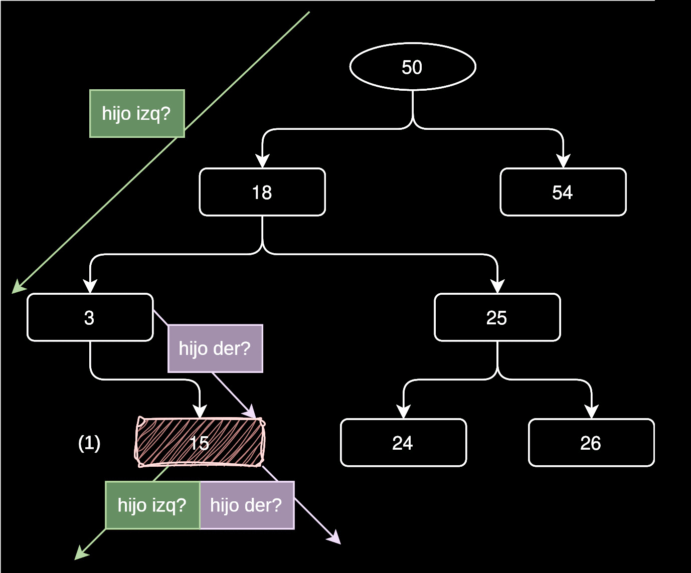

<div align="right">

</div>

# TDA ABB

# ESTO ES UN TEMPLATE, COMPLETAR LO QUE HAGA FALTA, ELIMINAR LO QUE SOBRE (INCLUIDA ESTA LÍNEA)

## Alumno: Maximiliano Fittipaldi - 111676 - mafittipaldi@fi.uba.ar

- Para compilar y ejecutar TODO:

```bash
make
```

- Para compilar y ejecutar pruebas:

```bash
make valgrind-alumno
```

- Para compilar y ejecutar tp:
```bash
make valgrind-tp_abb
```

---

## Teoría sobre árboles binarios
### ¿Qué es un árbol?
Un árbol es una colección de **nodos**.
Según la **rae** un nodo es:
*"En un esquema o representación gráfica en forma de árbol,*
*cada uno de los puntos de origen de las distintas ramificaciones."*
Y en esta definición tenemos dos conceptos interesantes: **ramificaciones** y
**puntos de origen**. En un árbol, siempre vamos a tener un punto de origen al
que vamos a llamar **raíz** y también, en caso de tener más de un nodo, vamos
a tener ramificaciones que van a otros nodos, en vez de hablar de la cantidad
de ramificaciones, vamos a hablar de cantidad de **nodos hijo** que posee el nodo
de origen, es decir, el **nodo padre**. Y, ¿Cómo llamaríamos a los nodos sin hijos?
Como vemos en un árbol de la vida real, cuando éste deja de ramificarse, aparecen
**hojas**, y las hojas ya no tienen ramas, ¿No? Bueno, para una estructura de árbol
podríamos llamar a estos nodos **nodos hoja**. Pero también vemos que los
nodos hijos, que a su vez tienen otros hijos, también califican como árboles, ¿Son árboles?
La respuesta es sí, también lo son, pero como están dentro de un árbol  más
grande los llamamos **subárboles**. Con todos estos conceptos, veámos
como sería la imágen final en un gráfico.

<div align="center">

</div>

En la imagen vemos claramente que el 15, el 39 y el 63 son nodos hoja, el 81
es el nodo raíz y, en su caso, el 33 es su hijo izquierdo. También notemos que
el diagrama posee un N=9 y h=4. El N podemos deducir fácilmente que se trata de 
la cantidad de elementos. El h es un poco más complicado, pero percatémosnos de que
justo coincide con el camino más largo que podemos hacer (ver línea de color).
El h (height) es la **altura** del árbol. Por último, nos falta otro concepto
importante, los **niveles**, que, si vemos las líneas punteadas, nos daremos
cuenta de que son la cantidad de "filas", donde cada "fila" tiene a los nodos
que están a en la misma **altura**.

### Tipos de árboles

#### Árbol general
Cumple las propiedades de un árbol. No impone más restricciones.

<div align="center">

</div>

#### Árbol binario
Además de cumplir las propiedades de un árbol genérico, tiene una restricción adicional:
sólo pueden haber **dos nodos hijo por cada nodo padre**. Esto es porque cuando lo
recorremos se trata de una decisión con dos posibilidades (binaria), para este trabajo
elegimos llamar a los nodos hijo **izquierda** y **derecha** (ya lo veremos), pero
bien podría ser **sí**/**no** **abierto**/**cerrado**, etc., según lo que necesitemos.

#### Árbol binario de búsqueda
Cumple todas las propiedades de un árbol, y además **tiene un criterio de búsqueda
y de inserción**. En nuestro caso, insertamos a los nodos mayores a la raíz a la 
derecha y a los menores a la izquierda, y así recursivamente para todos los subárboles.
De esta forma si sabemos que buscamos el 90 y nuestra raíz es el 50, ya sabemos que está
a la derecha del 50. Del mismo modo, podemos almacenar no sólo números, sino también
palabras y hacer un diccionario con búsqueda binaria, por ejemplo, o también organizar
eventos según las fechas, hay varias aplicaciones prácticas. 

### Operaciones
#### Inserción
Para árboles sin criterio de inserción, se insertarán según lo que requiera
el programador. Lo mismo aplica para los árboles binarios.
El asunto cambia para los ABB, dado que ya tenemos un criterio. En este trabajo,
si el elemento a insertar es mayor al actual, se insertará a la derecha, y si es
menor, a la izquierda.

#### Búsqueda
Nuevamente, para los árboles genéricos y binarios, se tendrá que recorrer
todo el árbol.
No obstante, para el ABB, no es necesario, dado que si buscamos el 100 y la raíz es
90, sabemos que el 100 (si es que existe) se encuentra en el subárbol de 90.
#### Eliminación
La eliminación de un nodo en un árbol binario de búsqueda (ABB) es un proceso
que puede variar dependiendo de la cantidad de hijos que tenga el nodo a
eliminar:

**Nodo sin hijos**: Simplemente se elimina el nodo.

**Nodo con un hijo**: Se elimina el nodo y se conecta su único hijo con el nodo padre.

**Nodo con dos hijos**: Este es el caso más complejo. En este escenario, debemos
encontrar un sucesor (el nodo más pequeño en el subárbol derecho) o un
predecesor (el nodo más grande en el subárbol izquierdo) para reemplazar el
nodo que se desea eliminar. Luego, se procede a eliminar el nodo deseado y se 
coloca el predecesor/sucesor en su lugar. Esto es válido dado que los
predecesores/sucesores nunca tienen dos hijos.
#### Recorridos 

Los recorridos de un árbol binario permiten acceder a sus nodos en diferentes
órdenes. Existen varias técnicas:

**Preorden NID**: En este recorrido, primero visitamos el nodo actual, luego el
subárbol izquierdo y finalmente el subárbol derecho. Este método es útil para
crear una copia del árbol.

**Inorden IND**: En este caso, primero se recorre el subárbol izquierdo, luego
el nodo actual y finalmente el subárbol derecho. Esta técnica es
particularmente valiosa en un ABB, ya que produce una secuencia de nodos
ordenada de menor a mayor.

**Postorden IDN**: Aquí, se recorre primero el subárbol izquierdo, luego el
subárbol derecho y, por último, el nodo actual. Este recorrido es ideal para
eliminar nodos, ya que asegura que se procesen primero los hijos antes que el
nodo padre.

**Por niveles (nivel a nivel)**: Este recorrido se realiza utilizando una cola.
Comienza en la raíz y se mueve de izquierda a derecha, visitando cada nivel del
árbol antes de pasar al siguiente.
#### Tabla de complejidades
- I: inespecífico
- N/A: no aplica

| Árbol/operación | inserción | búsqueda | eliminación | r preorden | r inorden | r postorden |
| ----------- | ----------- | ----------- | ----------- | ----------- | ----------- | ----------- |
| Árbol generico | I         | I        |  I          | N/A | N/A | N/A  |
| Árbol binario  | I | I | I | O(n) | O(n) | O(n) |
| ABB            | O(log(n))/O(n) | O(log(n))/O(n) | O(log(n))/O(n) | O(n) | O(n) | O(n) |

Dado que la inserción y búsqueda en el **árbol genérico y binario** son decisiones del programador,
queda inéspecífico, aunque lo más probable es que estas tres operaciones en ambas estructuras sean
O(n), dado que encontrar un nodo en una estructura sin criterio de búsqueda, se necesite recorrer
todo el árbol. Notemos que la búsqueda está implícitamente relacionada con la inserción y eliminación,
porque para insertar debemos *buscar* el lugar ideal, y para eliminar debemos *buscar* el elemento
que queremos eliminar.
En cuanto a los recorridos, en el árbol genérico no tenemos la restricción de dos nodos hijo por padre,
por ende, no podemos hablar de recorridos (pre/in/post)orden.

**Para el ABB cambia un poco**: tenemos un criterio de inserción y búsqueda. Recordemos: el criterio de
búsqueda es el que determina nuestra complejidad (o, por lo menos, la complejidad base). Si buscamos
en un árbol con la misma cantidad de nodos tanto en los subárboles izquierdo y derecho (**árbol balanceado**)
notaremos que cada vez que iteramos, vamos descartando la mitad de los elementos.
Supongamos que tenemos 100: el número que buscamos es mayor a 50 (nuestra raíz); vamos a la derecha y
ya descartamos 50 elementos de nuestra búsqueda; es menor a 75 (nodo actual); vamos a la izquierda y 
descartamos 25... y así sucesivamente hasta encontrar (o no en caso de inexistencia) el nodo buscado.
Para este tipo de casos en los cuales la cantidad de elementos descartados es la mitad, la complejidad
es O(log(n)). No obstante, para un **árbol no balanceado** la complejidad podría ser O(n), dado que, en el
peor de los casos, el árbol tiene hijos anidados todos a la derecha/izquierda, y aquí sólo queda
recorrer uno por uno hasta encontrar el elemento deseado.

### Importancia de distinguir estos árboles.
La distinción entre los diferentes tipos de árboles, como el árbol general, el
árbol binario y el árbol binario de búsqueda, es crucial por varias razones:

#### Estructura y organización
Cada tipo de árbol tiene su propia estructura y organización, lo que afecta
cómo se almacenan y gestionan los datos. Por ejemplo, un árbol binario se
limita a tener dos nodos hijo por cada nodo padre, lo que simplifica ciertos
procesos, mientras que un árbol general permite más flexibilidad.

#### Eficiencia en operaciones
La forma en que se organizan los nodos impacta directamente en la eficiencia de
las operaciones. En un árbol binario de búsqueda, las reglas de inserción y
búsqueda permiten acceder a los datos de manera más rápida y ordenada. Esto es
especialmente importante cuando se manejan grandes volúmenes de información,
donde cada milisegundo cuenta.

#### Aplicaciones Prácticas
La elección del tipo de árbol adecuado depende de la aplicación específica. Por
ejemplo, si estamos creando un diccionario, un árbol binario de búsqueda es
ideal porque facilita la búsqueda rápida de palabras. En cambio, si necesitamos
representar una jerarquía más compleja, un árbol general puede ser más
adecuado.

#### Mantenimiento de Propiedades
Cada tipo de árbol tiene propiedades que deben respetarse para que funcionen
correctamente. Comprender estas propiedades ayuda a evitar errores al
implementar algoritmos y a garantizar que las operaciones sobre los árboles
sean eficientes.

#### Flexibilidad en el Diseño
Conocer las diferencias entre los tipos de árboles permite a los programadores
elegir la estructura de datos más adecuada según las necesidades del problema
que están resolviendo, lo que resulta en un diseño de software más efectivo y
eficiente.


## Implementación

### Estructuras base
Antes de definir los distintos métodos, debemos definir la **estructura** sobre
la cual vamos a operar. Entonces, tenemos dos definiciones que son ménester para
abordar la implementación: el **árbol** propiamente dicho y los **nodos** que éste
contiene. Como estamos implementando un ABB, nuestro árbol se limitará a
tener nodos con dos hijos máximo y también éste tendrá un criterio de ordenamiento
basado en "preguntarse" si entre dos elementos uno es menor, mayor o igual que otro.
Con esto último debemos considerar que no es lo mismo comparar enteros que
strings (char*), por ende el comparador debe ser definido por el programador que 
utilice la librería, porque sólo él sabe lo que está almacenando, dado que nuestra
implementación debe ser lo más flexible posible para soportar el almacenamiento de
cualquier dato. Con todo esto en mente, definimos: 

```c
typedef struct nodo {
	void *elemento;
	struct nodo *izq;
	struct nodo *der;
} nodo_t;

struct abb {
	size_t nodos;
	nodo_t *raiz;
	int (*comparador)(void *, void *);
};
```
En efecto, cada nodo puede contener la dirección de un elemento de cualquier tipo y
la dirección de sus hijos. Todo esto será apuntado por nuestra estructura **abb**,
que almacena la **raíz**, con esto nos basta ya que vía esta tenemos acceso al resto
de nodos. Por último, también tenemos la dirección de la función comparadora definida
por el usuario de la librería que explicamos antes.

### Funcionamiento Interno de las Funciones del ABB
#### abb_crear
```c
abb_t *abb_crear(int (*comparador)(void *, void *))
```
- Entrada: Recibe un puntero a una función comparadora.
- Proceso:
Verifica si comparador es NULL. Si lo es, retorna NULL para indicar que no se
puede crear el árbol.
Utiliza calloc para asignar memoria para una nueva estructura abb_t. Esto
inicializa todos los campos a cero.
Asigna la función comparadora al campo correspondiente de la estructura.
Inicializa raiz como NULL y nodos como 0.
- Salida: Retorna un puntero a la nueva estructura abb_t si la creación fue
exitosa; de lo contrario, retorna NULL.
#### abb_destruir
```c
void abb_destruir(abb_t *abb)
```
- Entrada: Recibe un puntero a un árbol abb.
- Proceso:
Llama a abb_destruir_todo para liberar todos los nodos del árbol y sus elementos.
- Salida: No tiene retorno. La memoria del árbol es liberada.
#### abb_destruir_todo
```c
void abb_destruir_todo(abb_t *abb, void (*destructor)(void *))
```
- Entrada: Recibe un puntero al árbol abb y un puntero a una función destructor.
- Proceso:
Comprueba si abb es NULL. Si es así, no hace nada.
Si raiz no es NULL, llama a interna_destruir_todo para liberar recursivamente
todos los nodos, aplicando el destructor a cada elemento si se proporciona.
recordemos que en la parte teórica habíamos mencionado que hay un recorrido
útil para eliminar el árbol... sí, el postorden (IDN), ¿Por qué? Porque estamos
buscando los nodos hoja y, luego de liberarlos, podemos seguir con el resto.
De lo contrario, si usamos otro recorrido deberíamos almacenar en otro lugar
la dirección de los elementos siguientes para no perderlos, lo cual haría 
el proceso mucho más complicado. Obviamente, antes de borrar el nodo,
aplicamos la función destructura (si fue pasada), para liberar los datos internos.
Veamos cómo funciona:

<div align="center">

</div>

Finalemente, libera la memoria ocupada por la estructura abb.
- Salida: No retorna valor.
#### abb_insertar
```c
bool abb_insertar(abb_t *abb, void *elemento)
```
- Entrada: Recibe un puntero al árbol abb y un puntero al elemento a insertar.
- Proceso:
Comprueba si abb es NULL. Si es así, retorna false.
Llama a *interna_insertar*, que maneja la lógica de inserción y retorna true si
el elemento se insertó correctamente. Su interna recorre el árbol para insertar
el elemento en el lugar más adecuado haciendo una búsqueda binaria. Cuando
encontramos la posición, colocamos el elemento.
Si la inserción es exitosa, incrementa el contador de nodos (nodos).
- Salida: Retorna true si la inserción fue exitosa; de lo contrario, false.

#### abb_quitar

```c
bool abb_quitar(abb_t *abb, void *buscado, void **encontrado)
```

- Entrada: Recibe un puntero al árbol abb, un puntero al elemento a buscar y un puntero donde almacenar el elemento encontrado.
- Proceso:
Verifica si el árbol o su raíz son NULL. Si lo son, retorna false.
Busca el nodo que contiene el elemento a eliminar utilizando interna_obtener_nodo.
Si no se encuentra el nodo, retorna false.
Si encontrado no es NULL, almacena el elemento en la ubicación apuntada.
Dependiendo de la cantidad de hijos del nodo encontrado (ninguno, uno o dos),
llama a las funciones ajustar_punteros_hijo_der, ajustar_punteros_hijo_izq,
ajustar_punteros_dos_hijos o ajustar_punteros_sin_hijos para actualizar los
punteros del nodo padre.
Para ajustar los nodos en caso de dos hijos, se utiliza el predecesor inorden que,
en otras palabras, es el nodo con valor más cercano al nodo a borrar, pero del 
subárbol izquierdo. Veamos el ejemplo más complejo que se puede presentar:

<div align="center">

</div>

Notemos algo interesante: el predecesor inorden **NUNCA** puede tener un hijo derecho,
porque, supongamos que en vez de tener sólo el 18 con su hijo izquierdo, tenemos
que su hijo derecho es el 19, entonces, ¡El 19 sería el nuevo predecesor!, por ende
ya no usaríamos el 18 como muestra el diagrama, sino el 19.

Con el resto de casos es
mucho más simple, si el nodo no tiene hijos, eliminamos el nodo y listo, y si el nodo
tiene un hijo, su nuevo padre pasa a ser el padre del nodo eliminado (parecido al
caso más complejo de eliminación de dos hijos, en la línea azul).

Finalmente, la función, libera la memoria del nodo encontrado y decrementa el
contador de nodos.
- Salida: Retorna true si la eliminación fue exitosa.
#### abb_obtener
```c
void *abb_obtener(abb_t *abb, void *elemento)
```
- Entrada: Recibe un puntero al árbol abb y un puntero al elemento a buscar.
- Proceso:
Verifica si abb es NULL. Si es así, retorna NULL.
Busca el nodo que contiene el elemento utilizando *interna_obtener_nodo*.
Si no se encuentra el nodo, retorna NULL. La función interna utilizada
hace una búsqeda binaria, es decir, si el buscado es mayor, vamos a la derecha;
si el buscado es menor, vamos a la izquierda; si es igual, devolvemos el elemento
contenido;
- Salida: Retorna el elemento almacenado en el nodo encontrado o NULL si no se encontró.
#### abb_cantidad
```c
size_t abb_cantidad(abb_t *abb)
```
- Entrada: Recibe un puntero al árbol abb.
- Proceso:
Verifica si abb es NULL. Si es así, retorna 0.
- Salida: Retorna el contador de nodos (nodos).
#### abb_iterar_inorden
```c
size_t abb_iterar_inorden(abb_t *abb, bool (*f)(void *, void *), void *ctx)
```
- Entrada: Recibe un puntero al árbol abb, un puntero a una función f y un contexto ctx.
- Proceso:
Verifica si abb o su raíz son NULL, o si f es NULL. Si alguno lo es, retorna 0.
Inicializa un booleano seguir_iterando en true y llama a
interna_inorden_recursivo, que recorre el árbol y aplica la función f.
- Salida: Retorna la cantidad de veces que se invocó la función f.
#### abb_iterar_preorden
```c
    size_t abb_iterar_preorden(abb_t *abb, bool (*f)(void *, void *), void *ctx)
```
- Entrada: Recibe un puntero al árbol abb, un puntero a una función f y un contexto ctx.
- Proceso:
Realiza las mismas verificaciones que abb_iterar_inorden.
Llama a interna_preorden_recursivo para recorrer el árbol en preorden y aplicar f.
- Salida: Retorna el número de invocaciones de f.
#### abb_iterar_postorden
```c
size_t abb_iterar_postorden(abb_t *abb, bool (*f)(void *, void *), void *ctx)
```
- Entrada: Recibe un puntero al árbol abb, un puntero a una función f y un contexto ctx.
- Proceso:
Comprueba las mismas condiciones que las funciones anteriores.
Llama a interna_postorden_recursivo para recorrer el árbol en postorden y aplicar f.
- Salida: Retorna la cantidad de veces que se llamó a f.
#### abb_vectorizar_inorden
```c
size_t abb_vectorizar_inorden(abb_t *abb, void **vector, size_t tamaño)
```
- Entrada: Recibe un puntero al árbol abb, un puntero a un vector y el tamaño del vector.
- Proceso:
Verifica si vector es NULL. Si lo es, retorna 0.
Crea un contexto ctx_vectorizacion que almacena el vector, su tamaño y la posición actual.
Llama a abb_iterar_inorden, pasando la función vectorizadora_por_iteracion, que se encarga de llenar el vector.
- Salida: Retorna la cantidad de elementos que se guardaron en el vector.
#### abb_vectorizar_preorden
```c
size_t abb_vectorizar_preorden(abb_t *abb, void **vector, size_t tamaño)
```
- Entrada: Recibe un puntero al árbol abb, un puntero a un vector y su tamaño.
- Proceso:
Verifica si vector es NULL. Si lo es, retorna 0.
Crea un contexto similar al anterior.
Llama a abb_iterar_preorden con la función vectorizadora_por_iteracion.
- Salida: Retorna la cantidad de elementos guardados en el vector.
#### abb_vectorizar_postorden
```c
size_t abb_vectorizar_postorden(abb_t *abb, void **vector, size_t tamaño)
```
- Entrada: Recibe un puntero al árbol abb, un puntero a un vector y su tamaño.
- Proceso:
Realiza las mismas verificaciones que las funciones anteriores.
Crea un contexto y llama a abb_iterar_postorden con la función vectorizadora_por_iteracion.
- Salida: Retorna la cantidad de elementos que se guardaron en el vector.

